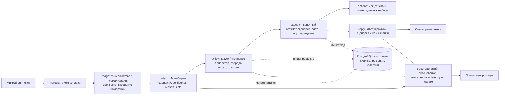
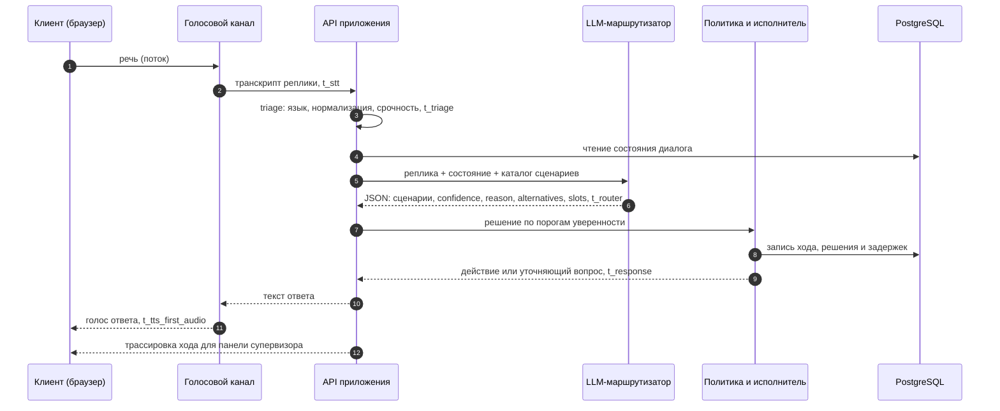
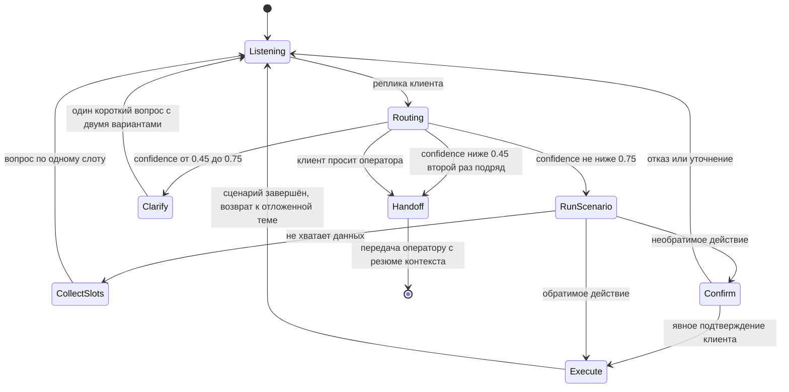
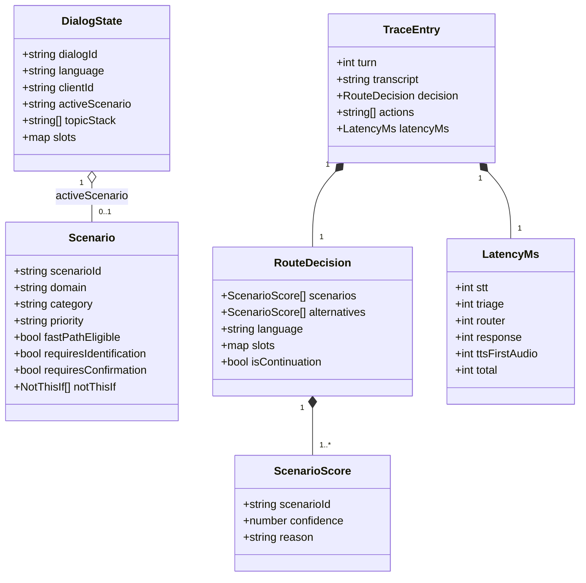
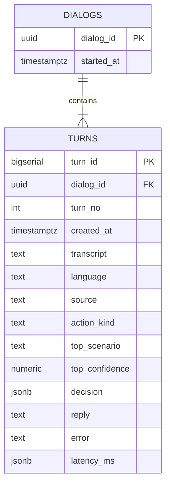

# Voice Router — гибридный голосовой AI-робот с LLM-слоем выбора сценария

     

Хакатон HackAlem AI 2026 ([Astana Hub](https://astanahub.com)) · трек 09 «Коммуникации» · кейс предоставлен
[Halyk Bank](https://halykbank.kz) · команда IITU+SPARTANS, Международный университет информационных технологий.

[Архитектура и история решений](ARCHITECTURE.md) · [Правила работы](AGENTS.md) · [Навыки для агентов](.agents/skills/) ·
[Задачи](../../issues)

> **Статус.** Работает сквозной сценарий: реплика голосом или текстом в веб-интерфейсе -> выбор сценария ->
> политика решений -> ответ робота на русском или казахском -> панель трассировки для супервизора; каждый ход пишется
> в журнал PostgreSQL. Запуск одной командой: `docker compose up --build`. Проверка кода: `pnpm verify`.
> Без ключа модели решение принимает демо-режим; с `OPENAI_API_KEY` — LLM-маршрутизатор; с `ROUTER_URL` — сервис
> выбора сценария на FastAPI. Развитие — в [задачах](../../issues).

---

## 1. Назначение решения

Голосовой робот контакт-центра хорошо распознаёт речь, но сценарий разговора у большинства систем выбирает
классификатор намерений. Он обучен на фиксированных формулировках и ошибается на живой речи: смена темы
посреди диалога, запрос на стыке двух сценариев, переход с русского на казахский внутри фразы. Каждая
ошибка выбора — перевод на оператора или потерянный клиент.

Voice Router заменяет классификатор LLM-слоем, который выбирает сценарий по контексту всего диалога,
и объясняет каждое решение.

| Пользователь | Что получает |
|---|---|
| Клиент контакт-центра | Говорит своими словами на русском или казахском; робот с первой реплики запускает нужный сценарий, переключается при смене темы без потери контекста, закрывает вопрос без оператора или передаёт оператору вместе с контекстом |
| Супервизор | Видит по каждой реплике выбранный сценарий, обоснование, альтернативы с уверенностью и время каждого этапа |

Данные — стартовый набор организаторов: вымышленная страховая компания Saqta Insurance, 40 сценариев
и 3 системных намерения, база знаний, тестовые клиенты, размеченные диалоги и реплики.

## 2. Архитектура

Модульный монолит: одно приложение Next.js на TypeScript, внутри — модули с явными границами и контрактами.
Состояние диалога и решения хранятся в PostgreSQL. Голос передаётся потоком между браузером и
голосовой моделью; решение о сценарии принимает LLM-маршрутизатор на сервере. Основной путь выбора
сценария — отдельный сервис `router` (Python, FastAPI, раздел 9); если он недоступен, приложение выбирает
сценарий само маршрутизатором ядра на TypeScript.

### 2.1. Конвейер обработки реплики



### 2.2. Один ход диалога с замером задержки



### 2.3. Политика принятия решений

Пороги и порядок взяты из раздела «Политика принятия решений» README стартового набора.



### 2.4. Модель предметной области



### 2.5. Схема базы данных (миграция `db/migrations/001_turn_journal.sql`)

Журнал ходов диалога для панели супервизора. Выбранный сценарий и уверенность вынесены в столбцы — по ним
строятся статистика и фильтр; полное решение и задержка хранятся в JSONB для показа.



Индексы: `turns (created_at DESC)` — лента последних ходов; `turns (top_scenario)` — статистика по сценарию.

## 3. Используемые технологии

| Слой | Технология | Назначение |
|---|---|---|
| Среда выполнения | Node.js 24 | сервер приложения |
| Пакеты | pnpm 12 (через corepack) | установка зависимостей, рабочее пространство |
| Приложение | Next.js 16, TypeScript 7 | веб-интерфейс и серверные маршруты API |
| Контракты | Zod | валидация ответа LLM и данных между модулями |
| Сервис выбора сценария | Python 3.11, FastAPI, Pydantic, OpenAI SDK (Responses API, structured output) | POST /route, раздел 9 |
| База данных | PostgreSQL 16 | состояние диалога, решения маршрутизатора, задержки |
| Голос и LLM | OpenAI API (Realtime, модели задаются в окружении) | распознавание и синтез речи, выбор сценария |
| Тесты | Vitest 5, pytest, Playwright | модульные, контрактные, интеграционные и сквозные тесты |
| Развёртывание | Docker Compose | запуск всей системы одной командой |

Точные версии фиксируются в `package.json` и `pnpm-lock.yaml`, для сервиса — в `backend/requirements.txt`.

## 4. Установка

Целевой порядок (обновляется вместе с кодом):

1. Установить Docker с поддержкой Compose.
2. Клонировать репозиторий.
3. Скопировать `.env.example` в `.env` и при необходимости указать ключ API (раздел 7).

Для запуска без Docker: Node.js 24, `corepack enable`, `pnpm install`, локальный PostgreSQL 16.

### Проверка кода (работает уже сейчас)

```bash
corepack enable        # включает pnpm нужной версии из поля packageManager
pnpm verify            # установка по lock-файлу, проверка типов, тесты
```

Ожидаемый результат: `Test Files 9 passed`, `Tests 66 passed`, проверка типов без ошибок.

Тесты сервиса выбора сценария (Python 3.11+, без сети и без ключа — клиент модели подменяется):

```bash
cd backend
python3 -m venv .venv && .venv/bin/pip install -r requirements-dev.txt
.venv/bin/python -m pytest      # ожидается: 69 passed
```

Та же цепочка описана для GitHub Actions в `.github/workflows/ci.yml`. Автоматический запуск в
организации хакатона сейчас недоступен (задачи не стартуют из-за блокировки биллинга организации),
поэтому проверка выполняется локально командой `pnpm verify`; workflow можно запустить вручную.

## 5. Запуск

```bash
docker compose up --build
```

Поднимает три сервиса: PostgreSQL 16 (`db`), приложение (`web`) и сервис выбора сценария (`router`).
Приложение ждёт готовности базы, применяет миграции и запускает сервер на http://localhost:3000; от `router`
оно не зависит. `router` слушает http://localhost:8000 и читает стартовый набор `data/kit` (только чтение).
Проверка готовности (`docker compose ps` показывает все три сервиса `healthy`):

```bash
curl http://localhost:3000/api/health
# {"ok":true,"db":true,"migrations":1}
curl http://localhost:8000/health
# {"status":"ok","model_key":true,"model":"gpt-5.4-mini","scenarios":40,"slots":43,"actions":31,"clients":11}
```

Без ключа OpenAI в `.env` система тоже запускается: `router` сообщает `"model_key":false` и отвечает 503 на
`/route`, приложение выбирает сценарий в демо-режиме.

Остановить: `docker compose down` (данные базы сохраняются в томе `db-data`; удалить вместе с ними —
`docker compose down -v`). Загрузка стартового набора данных добавляется вместе с миграциями схемы (#3).

Запуск без Docker: `cp .env.example .env`, указать `DATABASE_URL` локального PostgreSQL 16, затем
`pnpm install`, `pnpm db:migrate`, `pnpm --filter @voice-router/web dev`.

## 6. Необходимые зависимости

Docker и Docker Compose — для основного способа запуска. Для запуска без Docker — Node.js 24, pnpm 12,
PostgreSQL 16. Ключ OpenAI API нужен только для живого голосового режима (раздел 7).

## 7. Параметры окружения

Полный список с пояснениями — в `.env.example` (`cp .env.example .env`). Docker Compose читает `.env`
автоматически; строка подключения к базе в Compose задана в `docker-compose.yml`.

| Переменная | Назначение | Состояние |
|---|---|---|
| `DATABASE_URL` | строка подключения к PostgreSQL | используется |
| `OPENAI_API_KEY` | ключ для живого режима: распознавание, выбор сценария, синтез речи | используется: `router` и маршрутизатор ядра в `web` |
| `ROUTER_MODEL` | модель выбора сценария в `router`; пусто — `gpt-5.4-mini` | используется |
| `ROUTER_URL` | адрес сервиса выбора сценария для `web`; в Compose задан (`http://router:8000`) | используется при запуске без Docker |
| `DEMO_MODE` | режим проверки без личных ключей участников (Положение §5.6.6) | добавляется с маршрутизатором |

Секреты в репозиторий не попадают: `.env` исключён в `.gitignore`.

## 8. Порядок проверки основного сценария

Работает сейчас:

1. `pnpm verify` — установка по lock-файлу, проверка типов, модульные тесты.
2. `docker compose up --build`, затем `curl http://localhost:3000/api/health` — ожидается
   `{"ok":true,"db":true,...}`: приложение запущено, база доступна, миграции применены.
3. Ход диалога и журнал:

   ```bash
   curl -X POST localhost:3000/api/turn -H "Content-Type: application/json"      -d '{"utterance":"Когда будет выплата по моему заявлению?","state":{"lowConfidenceStreak":0,"history":[]}}'
   # ответ робота из фраз набора, trace (сценарий, действие, источник, задержка), state с dialogId
   curl "localhost:3000/api/turns?limit=5"
   # последние ходы из журнала PostgreSQL
   ```

   Без `OPENAI_API_KEY` и `ROUTER_URL` решение принимает демо-режим (помечен в `trace.source`).
4. Выбор сценария сервисом (нужен ключ в `.env`):
   `curl -X POST localhost:8000/route -d '{"utterance":"Когда будет выплата?","state":{}}'` — ожидается
   `"scenario_id":"SC17"` (раздел 9). В Compose ход через `/api/turn` идёт через сервис: `trace.source` —
   `router-service`.

Целевой сценарий (по мере готовности модулей):

1. Открыть веб-интерфейс, нажать микрофон и сказать, например: «Здравствуйте, я вчера оплатил, деньги
   списались, а полис не оформлен… и ещё адрес поменять надо».
2. Убедиться, что робот ответил голосом, а панель супервизора показала два сценария по порядку,
   обоснование, альтернативы и задержку по этапам.
3. Повторить реплику на казахском и со смешением языков.
4. Запустить замер точности маршрутизации на размеченном наборе организаторов (`dev_utterances.json`,
   `evaluate.py`): `backend/.venv/bin/python scripts/route_batch.py` (раздел 9).

## 9. Сервис выбора сценария

Выбор сценария — на LLM-слое: модель читает реплику, состояние диалога и каталог сценариев из данных набора
и возвращает сценарии в порядке упоминания. Классификатора намерений нет.

| Путь | Где | Когда работает |
|---|---|---|
| Основной | сервис `router` (`backend/`, FastAPI): POST /route, модель `gpt-5.4-mini` через Responses API со строгой JSON-схемой | `ROUTER_URL` задан, сервис отвечает |
| Резервный | маршрутизатор ядра на TypeScript (`packages/core/src/router`) внутри `web` | сервис недоступен или вернул ошибку, ключ есть |
| Демо | `demoDecision` ядра, без модели | нет ни сервиса, ни ключа (Положение §5.6.6) |

Сбой сервиса не обрывает разговор: `web` берёт решение резервным путём, причина сбоя видна в трассировке
(`trace.error`). Если сервис не отвечает (имя не разрешилось, соединение отклонено, таймаут запроса), `web` 30 с
не обращается к нему: остановленный контейнер иначе задерживал бы каждый ход (имя `router` не разрешается ~5 с).
Ответ сервиса с HTTP-ошибкой (502, 503, 504) паузу не включает: следующий ход снова идёт в сервис (ADR-015).

**Контракт.** Ответ совпадает с `RouteDecision` из `packages/core/src/contracts/route-decision.ts` и дополнен полями
для панели трассировки: `quote` у каждого сценария, `situation`, `response_language`, `latency_ms`, `model`, `usage`.
Совпадение проверяется с двух сторон на общей фикстуре `packages/core/src/contracts/fixtures/router-service-route.json`:
pytest сверяет с ней ответ эндпоинта, Vitest в `pnpm verify` — схему ядра.

Запрос: `POST /route`, тело — JSON `{"utterance": "...", "state": {...}}`. Тело читается как JSON при любом
`Content-Type`. `state` необязателен; принимается и формат сервиса (`active_scenario`, `pending_question`,
`stack`, `slots`, `response_language`, `last_turns`), и состояние веб-интерфейса (`activeScenario`, `history`,
`language`).

```bash
curl -X POST localhost:8000/route -d '{"utterance":"Когда будет выплата?","state":{}}'
```

```json
{"scenarios":[{"scenario_id":"SC17","confidence":0.98,
   "reason":"Фраза «Когда будет выплата?» — это запрос статуса существующего заявления.","quote":"Когда будет выплата?"}],
 "alternatives":[],"language":"ru","response_language":"ru","situation":"later claim status requested",
 "slots":{},"is_continuation":false,"latency_ms":1905,"model":"gpt-5.4-mini",
 "usage":{"input":8721,"cached":8448,"output":87}}
```

| Код | Когда |
|---|---|
| 200 | решение по контракту |
| 422 | тело не JSON, нет `utterance`, пустая или длиннее 2000 символов, `state` не объект |
| 502 | модель ответила ошибкой или без разобранного ответа |
| 503 | нет `OPENAI_API_KEY`; `/health` при этом работает и сообщает `"model_key":false` |
| 504 | модель не ответила за 6 с |

Инварианты закреплены в коде и тестах (`backend/tests/test_router.py`): ID сценариев только из данных набора
(enum в JSON-схеме модели), системное намерение не смешивается с бизнес-сценарием, порядок сценариев — по
позиции `quote` в реплике, пустой ответ модели становится `SYS_UNCLEAR`.

**Запуск отдельно от Compose** (ключ читается из корневого `.env`):

```bash
cd backend && .venv/bin/uvicorn app.main:app --port 8000
```

**Оценка на dev-наборе** (104 размеченные реплики `data/kit/dev_utterances.json`, `evaluate.py` организаторов;
нужен ключ; результаты — в `runs/`, вне git):

```bash
backend/.venv/bin/python scripts/route_batch.py
```

Результаты (подробно — [docs/ROUTER_LOG.md](docs/ROUTER_LOG.md)):

| Версия | Модель | primary_acc | full_match | intent_recall | медиана / p90 роутера, мс |
|---|---|---|---|---|---|
| v0 | gpt-4.1-mini | 0.971 | 0.981 | 1.000 | 1736 / 2461 |
| v4, 2 прогона | gpt-5.4-mini | 1.000 / 1.000 | 0.981 / 1.000 | 0.962 / 1.000 | 1476 / 2012 · 1585 / 2277 |
| v5 (сервис /route), 2 прогона | gpt-5.4-mini | 1.000 / 1.000 | 0.981 / 0.990 | 1.000 / 0.962 | 1603 / 2373 · 1656 / 2544 |
| v6 (обоснование на русском), 2 прогона | gpt-5.4-mini | 1.000 / 1.000 | 0.990 / 0.990 | 0.962 / 0.962 | 1813 / 2517 · 1852 / 2834 |

Dev-набор мал (104 реплики, 7 смешанных, 13 мультиинтентов): 1.000 на нём не гарантирует того же на скрытых
репликах жюри.

---

## Требования ТЗ и их реализация

| Требование ТЗ (Must-have) | Модуль | Issue |
|---|---|---|
| Голосовое взаимодействие в вебе | веб-интерфейс, голосовой канал | #4, #8 |
| Выбор сценария на LLM-слое, без классификатора намерений | router | #5 |
| Корректность выбора на 10 скрытых репликах жюри | router, policy, замер на dev-наборе | #5, #6, #9 |
| Панель трассировки после каждой реплики | trace, веб-интерфейс | #4 |
| Русский и казахский, смешение языков | triage, router | #5 |
| Подтверждение необратимых действий, передача оператору | policy, executor | #6 |
| Ответы только по данным набора | actions, reply | #7 |
| Запуск одной командой | Docker Compose | #10 |
| Опционально: быстрый путь для простых сценариев с замером выигрыша | router | #11 |

## Критерии оценки (из ТЗ)

| Критерий | Баллы |
|---|---|
| Соответствие задаче и работоспособность | 25 |
| Техническая реализация | 25 |
| README и воспроизводимость | 25 |
| Ценность и применимость решения | 15 |
| Потенциал развития и оригинальность подхода | 10 |

## Тестирование

Разработка ведётся по TDD: каждый модуль начинается с падающего теста.

| Уровень | Что проверяется | Инструмент |
|---|---|---|
| Модульный | triage, policy, нормализация, пороги уверенности | Vitest |
| Модульный (сервис) | инварианты маршрутизатора, HTTP-коды /route на поддельном клиенте модели | pytest |
| Эталонный | маршрутизатор на размеченных репликах организаторов | `scripts/route_batch.py` + `evaluate.py` |
| Контрактный | ответ LLM соответствует схеме, некорректный ответ отклоняется; ответ /route проходит схему ядра | Vitest + Zod, pytest |
| Интеграционный | полный ход диалога: реплика — решение — действие — трассировка | Vitest + PostgreSQL |
| Сквозной | веб-сценарий: ввод — ответ — панель супервизора | Playwright |

## Структура репозитория

| Путь | Содержимое | Ответственный |
|---|---|---|
| `apps/web/` | Next.js: интерфейс разговора, панель трассировки, маршруты API | Батырхан (интерфейс), Сырым (API) |
| `packages/core/` | модули triage, router, policy, executor, trace | Сырым |
| `backend/` | сервис выбора сценария (FastAPI): POST /route, загрузка и проверка набора | Сырым |
| `scripts/route_batch.py` | прогон dev-набора через сервис и оценка `evaluate.py` | Сырым |
| `packages/actions/` | мок-действия поверх данных набора | Жандаулет |
| `db/migrations/` | нумерованные SQL-миграции | Жандаулет |
| `data/kit/` | стартовый набор организаторов | Жандаулет |
| `tests/e2e/` | сквозные тесты Playwright | Батырхан |
| `docs/` | описание данных, контракты API, журнал итераций роутера (`ROUTER_LOG.md`) | команда |
| `.agents/skills/` | навыки для AI-агентов по этому репозиторию | команда |
| `ARCHITECTURE.md` | архитектурные решения и их история (ADR) | команда |

## Команда

Все участники — International Information Technology University (IITU), Алматы.

| Участник | GitHub | Telegram |
|---|---|---|
| Сырым Жакыпбеков (лидер) | @Syrym-Zhakypbekov | @syrym95kz |
| Нұрхан Батырхан | @batyrnurkhan | @batyrnurhan |
| Мусилимов Жандаулет | @zhmus00 | @zh_11_an |

## Инструменты и источники

Раскрытие по Положению §5.4.4 и §5.4.12.

- **Данные:** стартовый набор организаторов HackAlem AI по кейсу Halyk Bank (синтетические данные,
  вымышленная компания Saqta Insurance). Скрипт `evaluate.py` — из того же набора.
- **AI-инструменты разработки:** Claude Code (Anthropic), OpenAI Codex.
- **Модели в работе решения:** OpenAI API; выбор сценария в сервисе — `gpt-5.4-mini` (сравнение моделей —
  `docs/ROUTER_LOG.md`).
- **Библиотеки сервиса выбора сценария:** FastAPI, Uvicorn, Pydantic, pydantic-settings, OpenAI Python SDK;
  тесты — pytest, HTTPX.
- **Ранее созданный код** в решении не используется: код пишется в этом репозитории в ходе хакатона.
