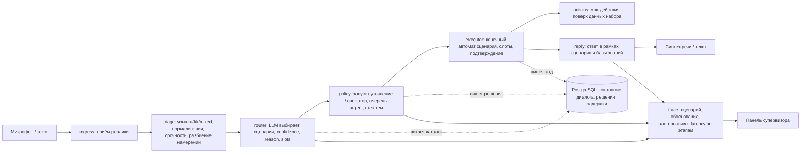
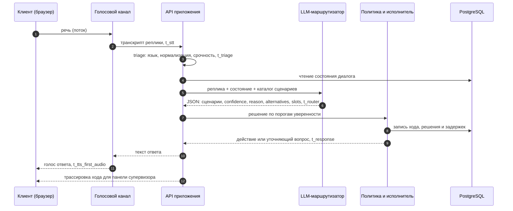
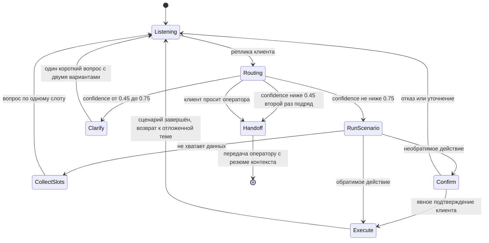
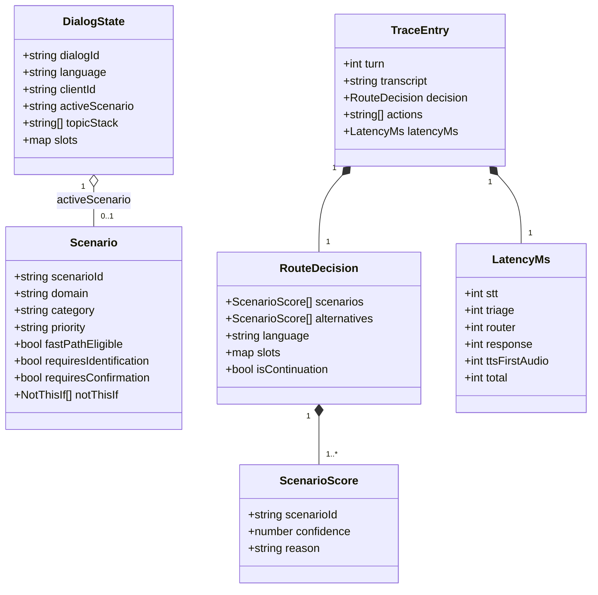
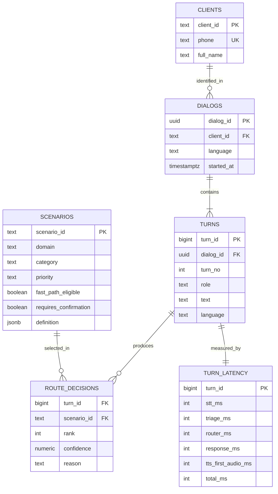

# Voice Router — гибридный голосовой AI-робот с LLM-слоем выбора сценария

Команда IITU+SPARTANS · HackAlem AI 2026 · трек 09 «Коммуникации» · владелец задачи: Halyk Bank.

> **Статус на текущий коммит.** Зафиксированы архитектура, стек, план работ и структура репозитория.
> Код решения в этом коммите намеренно отсутствует: модули добавляются следующими коммитами по одному,
> каждый начинается с теста (TDD). Разделы 4–8 описывают целевой порядок установки и проверки и
> обновляются по мере появления кода. План работ — в [issues](../../issues) (#2–#11).

---

## 1. Назначение решения

Голосовой робот контакт-центра хорошо распознаёт речь, но сценарий разговора у большинства систем выбирает
классификатор намерений. Он обучен на фиксированных формулировках и ошибается на живой речи: смена темы
посреди диалога, запрос на стыке двух сценариев, переход с русского на казахский внутри фразы. Каждая
ошибка выбора — перевод на оператора или потерянный клиент.

Voice Router заменяет классификатор LLM-слоем, который выбирает сценарий по контексту всего диалога,
и объясняет каждое решение.

| Пользователь | Что получает |
|---|---|
| Клиент контакт-центра | Говорит своими словами на русском или казахском; робот с первой реплики запускает нужный сценарий, переключается при смене темы без потери контекста, закрывает вопрос без оператора или передаёт оператору вместе с контекстом |
| Супервизор | Видит по каждой реплике выбранный сценарий, обоснование, альтернативы с уверенностью и время каждого этапа |

Данные — стартовый набор организаторов: вымышленная страховая компания Saqta Insurance, 40 сценариев
и 3 системных намерения, база знаний, тестовые клиенты, размеченные диалоги и реплики.

## 2. Архитектура

Модульный монолит: одно приложение Next.js на TypeScript, внутри — модули с явными границами и контрактами.
Состояние диалога и решения хранятся в PostgreSQL. Голос передаётся потоком между браузером и
голосовой моделью; решение о сценарии принимает LLM-маршрутизатор на сервере.

### 2.1. Конвейер обработки реплики



### 2.2. Один ход диалога с замером задержки



### 2.3. Политика принятия решений

Пороги и порядок взяты из раздела «Политика принятия решений» README стартового набора.



### 2.4. Модель предметной области



### 2.5. Схема базы данных (целевая, создаётся нумерованными миграциями)



## 3. Используемые технологии

| Слой | Технология | Назначение |
|---|---|---|
| Среда выполнения | Node.js 24 | сервер приложения |
| Пакеты | pnpm 12 (через corepack) | установка зависимостей, рабочее пространство |
| Приложение | Next.js 16, TypeScript 7 | веб-интерфейс и серверные маршруты API |
| Контракты | Zod | валидация ответа LLM и данных между модулями |
| База данных | PostgreSQL 16 | состояние диалога, решения маршрутизатора, задержки |
| Голос и LLM | OpenAI API (Realtime, модели задаются в окружении) | распознавание и синтез речи, выбор сценария |
| Тесты | Vitest 5, Playwright | модульные, контрактные, интеграционные и сквозные тесты |
| Развёртывание | Docker Compose | запуск всей системы одной командой |

Точные версии фиксируются в `package.json` и `pnpm-lock.yaml` при появлении кода.

## 4. Установка

Целевой порядок (обновляется вместе с кодом):

1. Установить Docker с поддержкой Compose.
2. Клонировать репозиторий.
3. Скопировать `.env.example` в `.env` и при необходимости указать ключ API (раздел 7).

Для запуска без Docker: Node.js 24, `corepack enable`, `pnpm install`, локальный PostgreSQL 16.

## 5. Запуск

Целевая команда:

```bash
docker compose up --build
```

Поднимает приложение и PostgreSQL, применяет миграции, загружает стартовый набор данных.

## 6. Необходимые зависимости

Docker и Docker Compose — для основного способа запуска. Для запуска без Docker — Node.js 24, pnpm 12,
PostgreSQL 16. Ключ OpenAI API нужен только для живого голосового режима (раздел 7).

## 7. Параметры окружения

Целевой набор переменных; полный список с пояснениями — в `.env.example`.

| Переменная | Назначение |
|---|---|
| `DATABASE_URL` | строка подключения к PostgreSQL |
| `OPENAI_API_KEY` | ключ для живого режима: распознавание, выбор сценария, синтез речи |
| `DEMO_MODE` | режим проверки без личных ключей участников (Положение §5.6.6) |

Секреты в репозиторий не попадают: `.env` исключён в `.gitignore`.

## 8. Порядок проверки основного сценария

Целевой сценарий проверки:

1. Открыть веб-интерфейс, нажать микрофон и сказать, например: «Здравствуйте, я вчера оплатил, деньги
   списались, а полис не оформлен… и ещё адрес поменять надо».
2. Убедиться, что робот ответил голосом, а панель супервизора показала два сценария по порядку,
   обоснование, альтернативы и задержку по этапам.
3. Повторить реплику на казахском и со смешением языков.
4. Запустить замер точности маршрутизации на размеченном наборе организаторов (`dev_utterances.json`,
   `evaluate.py`) — команда добавляется вместе с маршрутизатором.

---

## Требования ТЗ и их реализация

| Требование ТЗ (Must-have) | Модуль | Issue |
|---|---|---|
| Голосовое взаимодействие в вебе | веб-интерфейс, голосовой канал | #4, #8 |
| Выбор сценария на LLM-слое, без классификатора намерений | router | #5 |
| Корректность выбора на 10 скрытых репликах жюри | router, policy, замер на dev-наборе | #5, #6, #9 |
| Панель трассировки после каждой реплики | trace, веб-интерфейс | #4 |
| Русский и казахский, смешение языков | triage, router | #5 |
| Подтверждение необратимых действий, передача оператору | policy, executor | #6 |
| Ответы только по данным набора | actions, reply | #7 |
| Запуск одной командой | Docker Compose | #10 |
| Опционально: быстрый путь для простых сценариев с замером выигрыша | router | #11 |

## Критерии оценки (из ТЗ)

| Критерий | Баллы |
|---|---|
| Соответствие задаче и работоспособность | 25 |
| Техническая реализация | 25 |
| README и воспроизводимость | 25 |
| Ценность и применимость решения | 15 |
| Потенциал развития и оригинальность подхода | 10 |

## Тестирование

Разработка ведётся по TDD: каждый модуль начинается с падающего теста.

| Уровень | Что проверяется | Инструмент |
|---|---|---|
| Модульный | triage, policy, нормализация, пороги уверенности | Vitest |
| Эталонный | маршрутизатор на размеченных репликах организаторов | Vitest + `evaluate.py` |
| Контрактный | ответ LLM соответствует схеме, некорректный ответ отклоняется | Vitest + Zod |
| Интеграционный | полный ход диалога: реплика — решение — действие — трассировка | Vitest + PostgreSQL |
| Сквозной | веб-сценарий: ввод — ответ — панель супервизора | Playwright |

## Структура репозитория

| Путь | Содержимое | Ответственный |
|---|---|---|
| `apps/web/` | Next.js: интерфейс разговора, панель трассировки, маршруты API | Батырхан (интерфейс), Сырым (API) |
| `packages/core/` | модули triage, router, policy, executor, trace | Сырым |
| `packages/actions/` | мок-действия поверх данных набора | Жандаулет |
| `db/migrations/` | нумерованные SQL-миграции | Жандаулет |
| `data/kit/` | стартовый набор организаторов | Жандаулет |
| `tests/e2e/` | сквозные тесты Playwright | Батырхан |
| `docs/` | описание данных, контракты API | команда |

## Команда

Все участники — International Information Technology University (IITU), Алматы.

| Участник | GitHub | Telegram |
|---|---|---|
| Сырым Жакыпбеков (лидер) | @Syrym-Zhakypbekov | @syrym95kz |
| Нұрхан Батырхан | @batyrnurkhan | @batyrnurhan |
| Мусилимов Жандаулет | @zhmus00 | @zh_11_an |

## Инструменты и источники

Раскрытие по Положению §5.4.4 и §5.4.12.

- **Данные:** стартовый набор организаторов HackAlem AI по кейсу Halyk Bank (синтетические данные,
  вымышленная компания Saqta Insurance). Скрипт `evaluate.py` — из того же набора.
- **AI-инструменты разработки:** Claude Code (Anthropic), OpenAI Codex.
- **Модели в работе решения:** OpenAI API.
- **Ранее созданный код** в решении не используется: код пишется в этом репозитории в ходе хакатона.
