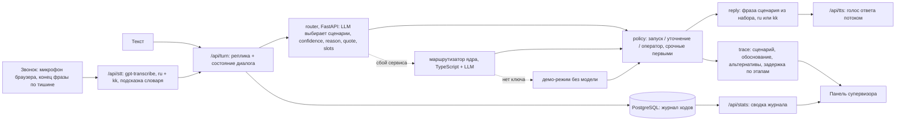
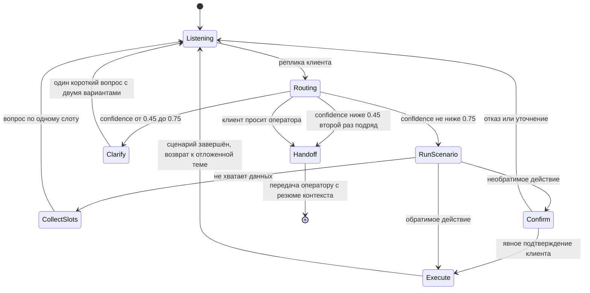
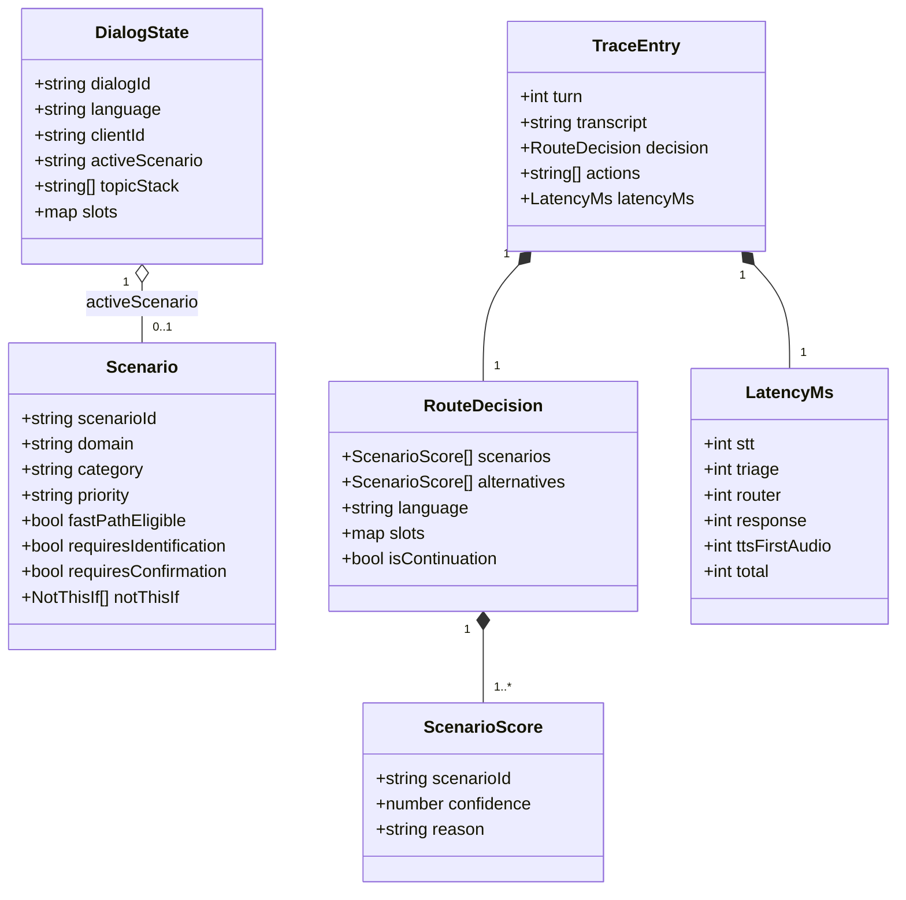
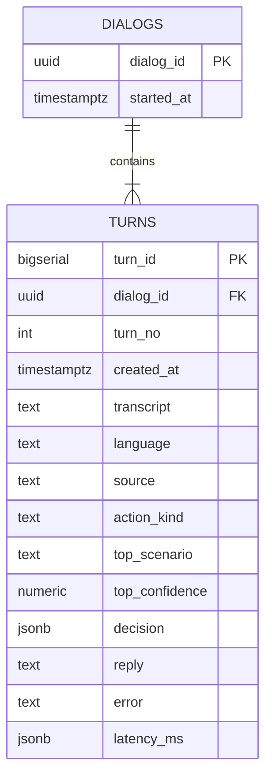

# Voice Router — гибридный голосовой AI-робот с LLM-слоем выбора сценария

     

Хакатон HackAlem AI 2026 ([Astana Hub](https://astanahub.com)) · трек 09 «Коммуникации» · кейс предоставлен
[Halyk Bank](https://halykbank.kz) · команда IITU+SPARTANS, Международный университет информационных технологий.

[Архитектура и история решений](ARCHITECTURE.md) · [Правила работы](AGENTS.md) · [Навыки для агентов](.agents/skills/) ·
[Задачи](../../issues)

> **Статус.** Работает сквозной сценарий: звонок роботу голосом в веб-интерфейсе (распознавание русской,
> казахской и смешанной речи на сервере, ответ голосом, робота можно перебить) или текст -> выбор сценария
> LLM-слоем -> политика решений -> ответ из фраз набора -> панель трассировки и статистика журнала для
> супервизора; каждый ход пишется в PostgreSQL. Замер на размеченном наборе организаторов (104 реплики,
> `evaluate.py`): primary_accuracy 1.000, full_match 0.990 (раздел 9). Запуск одной командой:
> `docker compose up --build`; проверка кода: `pnpm verify`. Без ключа модели работает демо-режим
> (Положение §5.6.6). Границы применимости — раздел 13.

---

## 1. Назначение решения

Голосовой робот контакт-центра хорошо распознаёт речь, но сценарий разговора у большинства систем выбирает
классификатор намерений. Он обучен на фиксированных формулировках и ошибается на живой речи: смена темы
посреди диалога, запрос на стыке двух сценариев, переход с русского на казахский внутри фразы. Каждая
ошибка выбора — перевод на оператора или потерянный клиент.

Voice Router заменяет классификатор LLM-слоем, который выбирает сценарий по контексту всего диалога,
и объясняет каждое решение.

| Пользователь | Что получает |
|---|---|
| Клиент контакт-центра | Говорит своими словами на русском или казахском; робот с первой реплики запускает нужный сценарий, переключается при смене темы без потери контекста, закрывает вопрос без оператора или передаёт оператору вместе с контекстом |
| Супервизор | Видит по каждой реплике выбранный сценарий, обоснование, альтернативы с уверенностью и время каждого этапа |

Данные — стартовый набор организаторов: вымышленная страховая компания Saqta Insurance, 40 сценариев
и 3 системных намерения, база знаний, тестовые клиенты, размеченные диалоги и реплики.

## 2. Архитектура

Модульный монолит на Next.js и TypeScript и отдельный сервис выбора сценария на FastAPI. Решение о сценарии
принимает LLM на сервере: основной путь — сервис `router` (раздел 9); при его сбое — маршрутизатор ядра на
TypeScript внутри приложения; без ключа — демо-режим. Голос в режиме звонка: браузер записывает реплику и
определяет её конец по тишине, сервер распознаёт речь (`gpt-transcribe`, ожидаемые языки ru и kk, подсказка из
словаря терминов набора) и озвучивает ответ (`gpt-4o-mini-tts`, потоком); без ключа работают распознавание и
синтез браузера (раздел 11). Журнал ходов хранится в PostgreSQL, сводку по нему видит супервизор (раздел 12).

### 2.1. Конвейер обработки реплики



### 2.2. Один ход диалога с замером задержки

```mermaid
sequenceDiagram
    autonumber
    participant C as Клиент (браузер, звонок)
    participant W as Приложение web
    participant S as OpenAI: распознавание и синтез
    participant R as Сервис router
    participant D as PostgreSQL
    C->>C: запись реплики, конец фразы по тишине
    C->>W: POST /api/stt (запись)
    W->>S: gpt-transcribe, языки ru и kk, подсказка словаря
    S-->>W: текст реплики
    W-->>C: текст, t_stt от конца речи
    C->>W: POST /api/turn (текст + состояние диалога)
    W->>R: POST /route (реплика + история)
    R-->>W: сценарии, confidence, reason, quote, alternatives, slots, t_router
    W->>W: политика по порогам, ответ из фраз набора, t_response
    W->>D: запись хода, решения и задержек
    W-->>C: ответ + трассировка для панели супервизора
    C->>W: GET /api/tts (текст ответа)
    W->>S: gpt-4o-mini-tts
    S-->>C: голос ответа потоком; клиент может перебить
```

### 2.3. Политика принятия решений

Пороги и порядок взяты из раздела «Политика принятия решений» README стартового набора.



Реализовано в политике (`packages/core/src/policy`, 10 тестов): запуск, уточнение с двумя вариантами, передача
оператору после двух неуверенных ходов подряд или по просьбе клиента (SC37), продолжение активного сценария,
очередь нескольких намерений со срочными первыми. Сбор слотов по одному и подтверждение необратимых действий —
следующий шаг (#6): сейчас робот не выполняет действий, а открывает сценарий фразой набора и просит данные.

### 2.4. Модель предметной области



### 2.5. Схема базы данных (миграция `db/migrations/001_turn_journal.sql`)

Журнал ходов диалога для панели супервизора. Выбранный сценарий и уверенность вынесены в столбцы — по ним
строятся статистика и фильтр; полное решение и задержка хранятся в JSONB для показа.



Индексы: `turns (created_at DESC)` — лента последних ходов; `turns (top_scenario)` — статистика по сценарию.

## 3. Используемые технологии

| Слой | Технология | Назначение |
|---|---|---|
| Среда выполнения | Node.js 24 | сервер приложения |
| Пакеты | pnpm 12 (через corepack) | установка зависимостей, рабочее пространство |
| Приложение | Next.js 16, TypeScript 7 | веб-интерфейс и серверные маршруты API |
| Контракты | Zod | валидация ответа LLM и данных между модулями |
| Сервис выбора сценария | Python 3.11, FastAPI, Pydantic, OpenAI SDK (Responses API, structured output) | POST /route, раздел 9 |
| База данных | PostgreSQL 16 | состояние диалога, решения маршрутизатора, задержки |
| LLM и голос | OpenAI API: `gpt-5.4-mini` — выбор сценария, `gpt-transcribe` — распознавание, `gpt-4o-mini-tts` — синтез; модели задаются в окружении | выбор сценария, режим звонка |
| Тесты | Vitest 5, pytest | модульные и контрактные тесты; эталонный замер — `evaluate.py` организаторов |
| Развёртывание | Docker Compose | запуск всей системы одной командой |

Точные версии фиксируются в `package.json` и `pnpm-lock.yaml`, для сервиса — в `backend/requirements.txt`.

## 4. Установка

1. Установить Docker с поддержкой Compose.
2. Клонировать репозиторий.
3. `cp .env.example .env`. Ключ OpenAI необязателен: без него система работает в демо-режиме. Для живого
   режима каждый проверяющий вписывает свой ключ в `OPENAI_API_KEY` (раздел 7); ключи команды в репозиторий
   не попадают.

Для запуска без Docker: Node.js 24, `corepack enable`, `pnpm install`, локальный PostgreSQL 16.

### Проверка кода

```bash
corepack enable        # включает pnpm нужной версии из поля packageManager
pnpm verify            # установка по lock-файлу, проверка типов, тесты
```

Ожидаемый результат: `Test Files 15 passed`, `Tests 111 passed`, проверка типов без ошибок. Тест словаря
терминов сверяет словарь с данными набора в `data/kit` (раздел 10).

Тесты сервиса выбора сценария (Python 3.11+, без сети и без ключа — клиент модели подменяется; набор в `data/kit`):

```bash
cd backend
python3 -m venv .venv && .venv/bin/pip install -r requirements-dev.txt
.venv/bin/python -m pytest      # ожидается: 70 passed
```

Та же цепочка описана для GitHub Actions в `.github/workflows/ci.yml`. Автоматический запуск в
организации хакатона сейчас недоступен (задачи не стартуют из-за блокировки биллинга организации),
поэтому проверка выполняется локально командой `pnpm verify`; workflow можно запустить вручную.

## 5. Запуск

```bash
docker compose up --build
```

Поднимает три сервиса: PostgreSQL 16 (`db`), приложение (`web`) и сервис выбора сценария (`router`).
Приложение ждёт готовности базы, применяет миграции и запускает сервер на http://localhost:3000; от `router`
оно не зависит. `router` слушает http://localhost:8000 и читает стартовый набор `data/kit` (только чтение).
Проверка готовности (`docker compose ps` показывает все три сервиса `healthy`):

```bash
curl http://localhost:3000/api/health
# {"ok":true,"db":true,"migrations":1}
curl http://localhost:8000/health
# {"status":"ok","model_key":true,"model":"gpt-5.4-mini","scenarios":40,"slots":43,"actions":31,"clients":11}
```

Голосовой канал и сводка для супервизора:

```bash
curl http://localhost:3000/api/stt
# {"available":true,"model":"gpt-transcribe"}  — с ключом; без ключа available:false
curl http://localhost:3000/api/stats
# сводка журнала ходов за 24 часа (раздел 12)
```

Без ключа OpenAI в `.env` система тоже запускается: `router` сообщает `"model_key":false` и отвечает 503 на
`/route`, приложение выбирает сценарий в демо-режиме, кнопка «Позвонить роботу» не показывается — остаются
микрофон браузера и текст.

Остановить: `docker compose down` (данные базы сохраняются в томе `db-data`; удалить вместе с ними —
`docker compose down -v`).

Запуск без Docker: `cp .env.example .env`, указать `DATABASE_URL` локального PostgreSQL 16, затем
`pnpm install`, `pnpm db:migrate`, `pnpm --filter @voice-router/web dev`.

## 6. Необходимые зависимости

Docker и Docker Compose — для основного способа запуска. Для запуска без Docker — Node.js 24, pnpm 12,
PostgreSQL 16, для сервиса выбора сценария — Python 3.11. Ключ OpenAI API нужен для живого режима: выбор
сценария моделью, серверное распознавание и голос робота (раздел 7). Для голоса — браузер с микрофоном
(Chrome или Edge); микрофон браузер даёт только на `localhost` или по HTTPS.

## 7. Параметры окружения

Полный список с пояснениями — в `.env.example` (`cp .env.example .env`). Docker Compose читает `.env`
автоматически; строка подключения к базе в Compose задана в `docker-compose.yml`.

| Переменная | Где читается | Назначение, значение по умолчанию |
|---|---|---|
| `OPENAI_API_KEY` | `web`, `router`, `pnpm stt:eval` | ключ живого режима; пусто — демо-режим, кнопка звонка скрыта |
| `DATABASE_URL` | `web`, `pnpm db:migrate` | строка подключения к PostgreSQL; в Compose задана в `docker-compose.yml` |
| `ROUTER_URL` | `web` | адрес сервиса выбора сценария; в Compose — `http://router:8000`; пусто — маршрутизатор ядра |
| `ROUTER_MODEL` | `web`, `router` | модель выбора сценария; пусто — `gpt-5.4-mini` |
| `ROUTER_BASE_URL`, `ROUTER_API_KEY` | `web` | любой OpenAI-совместимый вход (Chat Completions) для маршрутизатора ядра: тот же промпт и та же проверка ответа; пусто — OpenAI и `OPENAI_API_KEY` |
| `ROUTER_REASONING_EFFORT` | `web`, `router` | глубина рассуждения моделей gpt-5; пусто — `none` (быстрее) |
| `GEMINI_API_KEY`, `GEMINI_MODEL` | `web` | второй движок окна «Сравнить ChatGPT и Gemini» (раздел 12.1): Google Gemini через OpenAI-совместимый вход; пусто — окно сообщает, что ключ не задан; модель по умолчанию `gemini-3.8-flash` |
| `STT_MODEL` | `web` | модель распознавания речи; пусто — `gpt-transcribe` |
| `TTS_MODEL`, `TTS_VOICE` | `web` | модель и голос синтеза; пусто — `gpt-4o-mini-tts`, `coral` |
| `DATA_DIR`, `DATASET_DIR` | `web`, `router` | каталог стартового набора; пусто — `data/kit` (в контейнере `router` — `/data/kit`) |
| `STT_GLOSSARY` | `web` | путь к словарю терминов; пусто — `packages/core/src/stt/stt-glossary.json` |
| `KIT_DIR` | `pnpm glossary:build`, `pnpm stt:eval` | каталог набора для сборки словаря и оценки распознавания |

Секреты в репозиторий не попадают: `.env` исключён в `.gitignore`.

## 8. Порядок проверки основного сценария

1. `pnpm verify` — установка по lock-файлу, проверка типов, тесты (раздел 4).
2. `cp .env.example .env`, вписать свой `OPENAI_API_KEY`, затем `docker compose up --build`; проверить
   `curl http://localhost:3000/api/health` — `{"ok":true,"db":true,"migrations":1}`.
3. Открыть http://localhost:3000, нажать «Позвонить роботу» и разрешить микрофон. Сказать, например:
   «Здравствуйте, я вчера оплатил, деньги списались, а полис не оформлен… и ещё адрес поменять надо».
   Робот определит конец фразы по тишине и ответит голосом; справа панель супервизора покажет транскрипт,
   язык, источник решения, два сценария по порядку (SC30, затем SC29) с обоснованием и уверенностью,
   альтернативы и задержку по этапам.
4. Продолжить разговор на казахском и со смешением языков, например «Сәлеметсіз бе, мен кеше оплатил, а полис
   әлі жоқ, что делать?». Перебить робота голосом — ответ остановится, реплика будет записана.
5. Ниже в панели — статистика журнала: доли запуска, уточнения и передачи оператору, частые сценарии и ходы,
   где робот сомневался (раздел 12).
6. Тот же ход без интерфейса:

   ```bash
   curl -X POST localhost:3000/api/turn -H "Content-Type: application/json" \
     -d '{"utterance":"Когда будет выплата по моему заявлению?","state":{"lowConfidenceStreak":0,"history":[]}}'
   # ответ робота из фраз набора, trace (сценарий, обоснование, альтернативы, источник, задержка), state с dialogId
   curl "localhost:3000/api/turns?limit=5"   # последние ходы из журнала PostgreSQL
   ```

7. Замер точности на размеченных репликах организаторов (`dev_utterances.json`, `evaluate.py`) — раздел 9.

Без ключа шаги 1, 2 и 6 работают в демо-режиме (`trace.source = demo`, совпадение слов с примерами каталога);
это проверка работоспособности системы, а не решение задачи маршрутизации.

## 9. Сервис выбора сценария

Выбор сценария — на LLM-слое: модель читает реплику, состояние диалога и каталог сценариев из данных набора
и возвращает сценарии в порядке упоминания. Классификатора намерений нет.

| Путь | Где | Когда работает |
|---|---|---|
| Основной | сервис `router` (`backend/`, FastAPI): POST /route, модель `gpt-5.4-mini` через Responses API со строгой JSON-схемой | `ROUTER_URL` задан, сервис отвечает |
| Резервный | маршрутизатор ядра на TypeScript (`packages/core/src/router`) внутри `web` | сервис недоступен или вернул ошибку, ключ есть |
| Демо | `demoDecision` ядра, без модели | нет ни сервиса, ни ключа (Положение §5.6.6) |

Сбой сервиса не обрывает разговор: `web` берёт решение резервным путём, причина сбоя видна в трассировке
(`trace.error`). Если сервис не отвечает (имя не разрешилось, соединение отклонено, таймаут запроса), `web` 30 с
не обращается к нему: остановленный контейнер иначе задерживал бы каждый ход (имя `router` не разрешается ~5 с).
Ответ сервиса с HTTP-ошибкой (502, 503, 504) паузу не включает: следующий ход снова идёт в сервис (ADR-015).

**Контракт.** Ответ совпадает с `RouteDecision` из `packages/core/src/contracts/route-decision.ts` и дополнен полями
для панели трассировки: `quote` у каждого сценария, `situation`, `response_language`, `latency_ms`, `model`, `usage`.
Совпадение проверяется с двух сторон на общей фикстуре `packages/core/src/contracts/fixtures/router-service-route.json`:
pytest сверяет с ней ответ эндпоинта, Vitest в `pnpm verify` — схему ядра.

Запрос: `POST /route`, тело — JSON `{"utterance": "...", "state": {...}}`. Тело читается как JSON при любом
`Content-Type`. `state` необязателен; принимается и формат сервиса (`active_scenario`, `pending_question`,
`stack`, `slots`, `response_language`, `last_turns`), и состояние веб-интерфейса (`activeScenario`, `history`,
`language`).

```bash
curl -X POST localhost:8000/route -d '{"utterance":"Когда будет выплата?","state":{}}'
```

```json
{"scenarios":[{"scenario_id":"SC17","confidence":0.98,
   "reason":"Фраза «Когда будет выплата?» — это запрос статуса существующего заявления.","quote":"Когда будет выплата?"}],
 "alternatives":[],"language":"ru","response_language":"ru","situation":"later claim status requested",
 "slots":{},"is_continuation":false,"latency_ms":1905,"model":"gpt-5.4-mini",
 "usage":{"input":8721,"cached":8448,"output":87}}
```

| Код | Когда |
|---|---|
| 200 | решение по контракту |
| 422 | тело не JSON, нет `utterance`, пустая или длиннее 2000 символов, `state` не объект |
| 502 | модель ответила ошибкой или без разобранного ответа |
| 503 | нет `OPENAI_API_KEY`; `/health` при этом работает и сообщает `"model_key":false` |
| 504 | модель не ответила за 6 с |

Инварианты закреплены в коде и тестах (`backend/tests/test_router.py`): ID сценариев только из данных набора
(enum в JSON-схеме модели), системное намерение не смешивается с бизнес-сценарием, порядок сценариев — по
позиции `quote` в реплике, пустой ответ модели становится `SYS_UNCLEAR`.

**Запуск отдельно от Compose** (ключ читается из корневого `.env`):

```bash
cd backend && .venv/bin/uvicorn app.main:app --port 8000
```

**Оценка на dev-наборе** (104 размеченные реплики `data/kit/dev_utterances.json`, `evaluate.py` организаторов;
нужен ключ; результаты — в `runs/`, вне git):

```bash
backend/.venv/bin/python scripts/route_batch.py
```

Результаты (подробно — [docs/ROUTER_LOG.md](docs/ROUTER_LOG.md)):

| Версия | Модель | primary_acc | full_match | intent_recall | медиана / p90 роутера, мс |
|---|---|---|---|---|---|
| v0 | gpt-4.1-mini | 0.971 | 0.981 | 1.000 | 1736 / 2461 |
| v4, 2 прогона | gpt-5.4-mini | 1.000 / 1.000 | 0.981 / 1.000 | 0.962 / 1.000 | 1476 / 2012 · 1585 / 2277 |
| v5 (сервис /route), 2 прогона | gpt-5.4-mini | 1.000 / 1.000 | 0.981 / 0.990 | 1.000 / 0.962 | 1603 / 2373 · 1656 / 2544 |
| v6 (обоснование на русском), 2 прогона | gpt-5.4-mini | 1.000 / 1.000 | 0.990 / 0.990 | 0.962 / 0.962 | 1813 / 2517 · 1852 / 2834 |
| весь стек, сервис напрямую `POST :8000/route`, 3 параллельно | gpt-5.4-mini | 1.000 | 0.990 | 1.000 | 1598 / 2209 |
| весь стек, через `POST /api/turn` после #34, 3 параллельно | gpt-5.4-mini | 1.000 | 0.990 | 0.962 | 1736 / 2967 |

Последние две строки — замер 23.09 в сети площадки хакатона на запущенном `docker compose up --build`.
В прогоне через `/api/turn` 3 из 104 ответов модели не уложились в 6 с (504); эти ходы обслужил резервный
маршрутизатор ядра, и все три выбраны верно.

Dev-набор мал (104 реплики, 7 смешанных, 13 мультиинтентов): 1.000 на нём не гарантирует того же на скрытых
репликах жюри.

## 10. Словарь терминов для распознавания речи

Названия продуктов и термины (ОГПО, КАСКО, ДМС, полис, сақтандыру) распознаются хуже обычной речи, а ошибка
распознавания ведёт к неверному выбору сценария. Словарь терминов передаётся в распознавание речи как
подсказка (issue #8). Код — `packages/core/src/stt/`, точка подключения — `@voice-router/core/stt`.

**Откуда берутся термины.** Только из данных набора (`scenarios.json`, `slots.json`), правилами; в коде нет
ни одного термина. Проверочные реплики `dev_utterances.json` в сборке не участвуют.

| Правило | Что даёт |
|---|---|
| Аббревиатура: 2–6 заглавных букв в репликах; то же слово строчными («каско») сводится к ней | ОГПО, КАСКО, ДМС, ИИН, ЖСН, ДТП, SMS |
| Доменное слово: от 4 букв, его говорят и клиент (в examples не меньше 2 раз), и оператор (responses, prompt слотов); служебные слова отсекает короткий стоп-лист по категориям (местоимения, союзы, послелоги, вежливость, вспомогательные глаголы) | страховка, сақтандыру, полис, көлік, өтініш |
| Язык термина — по языку текстов, где он встречается | списки `ru`, `kk` и общий `shared` |
| Значение enum-слота после транслитерации (ogpo → огпо) связывает термин со слотом | ОГПО ↔ `product_type=ogpo`, Алматы ↔ `city=Almaty` |
| Формат номера — буквенный префикс из `pattern` слота | SQ-OGPO, SQ-CASCO, CL |

Порядок — по важности: число сценариев, в репликах клиента которых встречается термин, затем частота, затем
алфавит. Для каждого термина берётся самая короткая реплика клиента с ним на ru и на kk.

**Как пересобрать.** Словарь хранится в `packages/core/src/stt/stt-glossary.json` и собирается детерминированно:

```bash
pnpm glossary:build                    # набор из data/kit
pnpm glossary:build --kit <каталог>     # или KIT_DIR=<каталог>
pnpm glossary:build --check            # артефакт соответствует данным набора
```

**Как передаётся в распознавание.** `buildTranscriptionHints(glossary, { model })` возвращает поля `model`,
`prompt`, `keywords`, `languages` — одинаковые для `POST /v1/audio/transcriptions` и для транскрипции в
Realtime-сессии (`session.audio.input.transcription`).

- `prompt` — короткие реплики клиента из набора на ru и kk с главными терминами, затем список остальных:
  по естественной фразе модель лучше держит стиль, чем по голому списку.
- `gpt-transcribe`, `gpt-live-transcribe`: термины дополнительно в `keywords` (до 40), языки —
  `languages: ["ru", "kk"]`.
- `gpt-4o-transcribe`, `gpt-4o-mini-transcribe`, `whisper-1` принимают только один `language`. Его не задаём:
  фиксированный язык ломает речь с переходом с языка на язык внутри фразы. Оба языка задаёт подсказка.
- Бюджет подсказки: 200 символов для `whisper-1` (предел 224 токена), 800 — для остальных. Точный предел
  для моделей gpt-* в документации OpenAI не указан, 800 символов и 40 ключевых слов — наше допущение.

**Оценка.** Скрипт выбирает из `dev_utterances.json` реплики с продуктовыми терминами (15 из 104: ru 8, kk 5,
mixed 2), синтезирует их речь (`gpt-4o-mini-tts`) и распознаёт дважды — без подсказки и с подсказкой. Считает
долю реплик, где все термины распознаны без искажения, полноту терминов и WER по ru, kk, mixed.

```bash
pnpm stt:eval --dry-run    # выборка и подсказка, без обращений к API
pnpm stt:eval              # нужен OPENAI_API_KEY; отчёт в test-results/stt-eval/report.md (вне git)
```

Результаты замера (распознавание `gpt-transcribe`, синтез `gpt-4o-mini-tts`, 15 реплик):

| Язык | n | Термины без искажения: без / с подсказкой | WER: без / с подсказкой |
|---|---|---|---|
| ru | 8 | 62.5 % / 87.5 % | 0.060 / 0.010 |
| kk | 5 | 40.0 % / 100.0 % | 0.460 / 0.050 |
| mixed | 2 | 50.0 % / 100.0 % | 0.205 / 0.000 |
| все | 15 | 53.3 % / 93.3 % | 0.212 / 0.022 |

Ограничение: синтезированная речь чище живой (без шума, акцента и оговорок), поэтому замер показывает вклад
подсказки при прочих равных. Итоговая проверка — живым голосом.

## 11. Голосовой канал и режим звонка

ТЗ: «жюри говорит в микрофон — робот распознаёт и отвечает голосом»; две проверочные реплики на казахском и
одна со смешением языков. Распознавание браузера слушает один заранее выбранный язык и режет смешанную фразу,
а голоса для казахского в Windows часто нет, поэтому с ключом голос идёт через сервер (ADR-016).

- **Режим звонка** (`apps/web/components/use-voice-call.ts`, `CallScreen.tsx`): микрофон открыт весь звонок;
  порог речи считается от шума, измеренного в первые 0,6 с; конец фразы — 0,8 с тишины; фраза до 12 с.
  Во время ответа запись продолжается: если клиент говорит поверх робота 0,3 с, голос останавливается сразу, а
  начало его фразы уже записано. Экран показывает фазу (слушаю, вы говорите, распознаю, выбираю сценарий, робот
  отвечает), таймер, субтитры и выбранный сценарий.
- **`POST /api/stt`** — запись реплики в `gpt-transcribe` с `languages: ["ru","kk"]` и подсказкой из словаря
  терминов (раздел 10). `GET /api/stt` сообщает, доступно ли распознавание.
- **`GET /api/tts`** — голос ответа (`gpt-4o-mini-tts`) потоком: воспроизведение начинается с первых байт.
- `sttMs` в трассировке считается от конца речи клиента до готового текста.

Проверка по кругу (синтез -> распознавание через `/api/tts` и `/api/stt`, 23.09):

| Реплика | Распознано | Время распознавания |
|---|---|---|
| kk: «Сәлеметсіз бе, машинамды парковкада сызып кетті, КАСКО бойынша өтініш бергім келеді» | дословно | 1,5 с |
| ru: «…я вчера оплатил, деньги списались, а полис не оформлен, и ещё адрес поменять надо» | дословно | 0,85 с |
| смешанная: «Сәлеметсіз бе, мен вчера оплатил, а полис әлі жоқ, что делать?» | «Сәлеметсіз бе, мен кеше оплатил, а полис әлі жоқ. Что делать?» | 0,9 с |

Первый звук ответа от `/api/tts` — 0,7–1,0 с.

## 12. Статистика для супервизора

ТЗ: супервизор «видит, какие сценарии выбирались, где робот сомневался и ошибся». `GET /api/stats` — сводка
журнала ходов за 24 часа; агрегаты считает PostgreSQL по индексу `created_at`, приложение не выгружает строки.
В панели: число ходов и диалогов, доли запуска, уточнения и передачи оператору, сбои источника решения,
задержка маршрутизатора p50/p95, частые сценарии со средней уверенностью и последние сомнительные ходы
(уточнение, оператор, уверенность ниже 0.75, ошибка источника). Блок обновляется после каждого хода и по кнопке,
без периодического опроса.

### 12.1. Окно «Сравнить ChatGPT и Gemini»

Кнопка в заголовке панели супервизора открывает модальное окно: реплика выбранного хода уходит одновременно в два
движка выбора сценария — OpenAI (`gpt-5.4-mini`) и Google Gemini (`gemini-3.8-flash`) — через один и тот же
OpenAI-совместимый вход, с одним промптом и одной проверкой ответа (контракт `RouteDecision`). В окне две колонки:
сценарий, обоснование, альтернативы, задержка выбора и число попыток каждого движка; сверху — совпал ли основной
сценарий. Так супервизор видит, где решение устойчиво к смене модели, а где движки расходятся.

Сравнение — инструмент супервизора, не путь диалога: состояние разговора не меняется, ход в журнал не пишется,
сервис `router` не задействован. Движок без ключа показывается как недоступный (окно называет переменную), а не
получает демо-решение. Код: `apps/web/app/api/compare/route.ts` (`GET` — какие движки настроены, `POST` — сравнение),
`apps/web/lib/server/compare.ts` (чистая функция, тесты `compare.test.ts` без сети), `apps/web/components/CompareModal.tsx`,
модальные окна — `apps/web/components/Modal.tsx` на нативном `<dialog>`.

## 13. Границы применимости и безопасность

- **Задержка.** Ориентир ТЗ — 1,5 с от конца реплики до начала ответа. Сейчас в режиме звонка 3–4 с:
  распознавание ~1 с, выбор сценария ~1,6 с (медиана), первый звук синтеза ~0,7 с, плюс 0,8 с тишины для
  определения конца фразы. Ускорение: потоковое распознавание, быстрый путь для очевидных запросов (#11),
  параллельный запуск синтеза. Задержка по ТЗ даёт дополнительные баллы и не снижает основную оценку.
- **Действия.** Робот не выполняет необратимых действий: он открывает сценарий фразой из набора и просит
  данные. Исполнитель сценария с подтверждением — следующий шаг (#6).
- **Неуверенность видна.** У каждого решения — уверенность и обоснование с цитатой клиента; при уверенности
  0.45–0.75 робот уточняет, после двух неуверенных ходов подряд или по просьбе клиента передаёт разговор
  оператору. Модель не единственный источник истины: политика решений детерминирована (ADR-004).
- **Демо-режим** без ключа подбирает сценарий по совпадению слов с примерами каталога. Он нужен, чтобы система
  запускалась у проверяющего без личных ключей, и не является решением задачи маршрутизации.
- **Точность.** 1.000 по первому сценарию на 104 размеченных репликах не гарантирует того же на скрытых
  репликах жюри: dev-набор мал (7 смешанных, 13 мультиинтентов).
- **Голос.** Нужен браузер с микрофоном; вне `localhost` — только по HTTPS. В шумном зале порог речи
  подстраивается под фон, но посторонняя речь рядом может начать ход.
- **Данные.** Компания и клиенты вымышленные; во внешние API (LLM, распознавание, синтез) уходят только реплики
  разговора на синтетических данных.

---

## Требования ТЗ и их реализация

| Требование ТЗ (Must-have) | Реализация | Issue, PR |
|---|---|---|
| Голосовое взаимодействие в вебе | режим звонка: серверное распознавание ru/kk, голос ответа, перебивание (раздел 11) | #4, #8, #33 |
| Выбор сценария на LLM-слое, без классификатора намерений | сервис `router` (FastAPI), резерв — маршрутизатор ядра (раздел 9) | #5, #23, #30 |
| Корректность выбора на 10 скрытых репликах жюри | замер на dev-наборе: primary 1.000, full_match 0.990 | #9 |
| Панель трассировки после каждой реплики | сценарий, обоснование с цитатой, альтернативы, задержка по этапам | #4, #18 |
| Русский и казахский, смешение языков | распознавание с ожидаемыми ru и kk, выбор сценария по смыслу | #5, #8, #20 |
| Переспросить вместо угадывания, передать оператору | политика решений (раздел 2.3) | #6 |
| Супервизор видит, где робот сомневался | статистика журнала (раздел 12) | #35 |
| Explainability: логика, а не голый вердикт | окно сравнения двух движков на одной реплике — где решение устойчиво к смене модели (раздел 12.1) | #40 |
| Ответы только по данным набора | фразы сценариев и системных намерений из `scenarios.json` | #19 |
| Запуск одной командой | Docker Compose: `db`, `router`, `web` | #10 |
| Опционально: быстрый путь для простых сценариев | не реализовано, план в разделе 13 | #11 |

## Критерии оценки (из ТЗ)

| Критерий | Баллы |
|---|---|
| Соответствие задаче и работоспособность | 25 |
| Техническая реализация | 25 |
| README и воспроизводимость | 25 |
| Ценность и применимость решения | 15 |
| Потенциал развития и оригинальность подхода | 10 |

## Тестирование

Разработка ведётся по TDD: каждый модуль начинается с падающего теста.

| Уровень | Что проверяется | Инструмент |
|---|---|---|
| Модульный | политика решений, промпт и маршрутизатор ядра, ответ робота, словарь терминов, распознавание, сводка журнала, миграции | Vitest |
| Модульный (сервис) | инварианты маршрутизатора, промпт, HTTP-коды /route на поддельном клиенте модели | pytest |
| Контрактный | ответ LLM соответствует схеме, некорректный отклоняется; ответ /route проходит схему ядра на общей фикстуре | Vitest + Zod, pytest |
| Эталонный | выбор сценария на 104 размеченных репликах организаторов | `scripts/route_batch.py` + `evaluate.py` |
| Ручной сквозной | звонок в браузере: речь — ответ голосом — панель супервизора | Chrome, раздел 8 |

## Структура репозитория

| Путь | Содержимое | Ответственный |
|---|---|---|
| `apps/web/` | Next.js: интерфейс разговора, режим звонка, панель трассировки и статистика, маршруты API | Батырхан (интерфейс), Сырым (API, голос) |
| `packages/core/` | модули triage, router, policy, executor, trace | Сырым |
| `backend/` | сервис выбора сценария (FastAPI): POST /route, загрузка и проверка набора | Батырхан |
| `scripts/route_batch.py` | прогон dev-набора через сервис и оценка `evaluate.py` | Батырхан |
| `packages/core/src/stt/` | словарь терминов и подсказка для распознавания речи | Батырхан |
| `scripts/glossary-build.ts`, `scripts/stt-eval.ts` | сборка словаря терминов, оценка распознавания | Батырхан |
| `packages/actions/` | заготовка: мок-действия поверх данных набора (#7) | Жандаулет |
| `db/migrations/` | нумерованные SQL-миграции | Жандаулет |
| `data/kit/` | стартовый набор организаторов | Жандаулет |
| `tests/e2e/` | заготовка сквозных тестов | Батырхан |
| `analytics/` | заметки команды о ходе работы и проверке Docker | Жандаулет |
| `docs/` | описание данных, контракты API, журнал итераций роутера (`ROUTER_LOG.md`) | команда |
| `.agents/skills/` | навыки для AI-агентов по этому репозиторию | команда |
| `ARCHITECTURE.md` | архитектурные решения и их история (ADR) | команда |

## Команда

Все участники — International Information Technology University (IITU), Алматы.

| Участник | GitHub | Telegram |
|---|---|---|
| Сырым Жакыпбеков (лидер) | @Syrym-Zhakypbekov | @syrym95kz |
| Нұрхан Батырхан | @batyrnurkhan | @batyrnurhan |
| Мусилимов Жандаулет | @zhmus00 | @zh_11_an |

## Инструменты и источники

Раскрытие по Положению §5.4.4 и §5.4.12.

- **Данные:** стартовый набор организаторов HackAlem AI по кейсу Halyk Bank (синтетические данные,
  вымышленная компания Saqta Insurance). Скрипт `evaluate.py` — из того же набора.
- **AI-инструменты разработки:** Claude Code (Anthropic), OpenAI Codex.
- **Модели в работе решения:** OpenAI API; выбор сценария в сервисе — `gpt-5.4-mini` (сравнение моделей —
  `docs/ROUTER_LOG.md`); распознавание речи `gpt-transcribe`, синтез речи `gpt-4o-mini-tts`.
- **Библиотеки сервиса выбора сценария:** FastAPI, Uvicorn, Pydantic, pydantic-settings, OpenAI Python SDK;
  тесты — pytest, HTTPX.
- **Ранее созданный код** в решении не используется: код пишется в этом репозитории в ходе хакатона.
